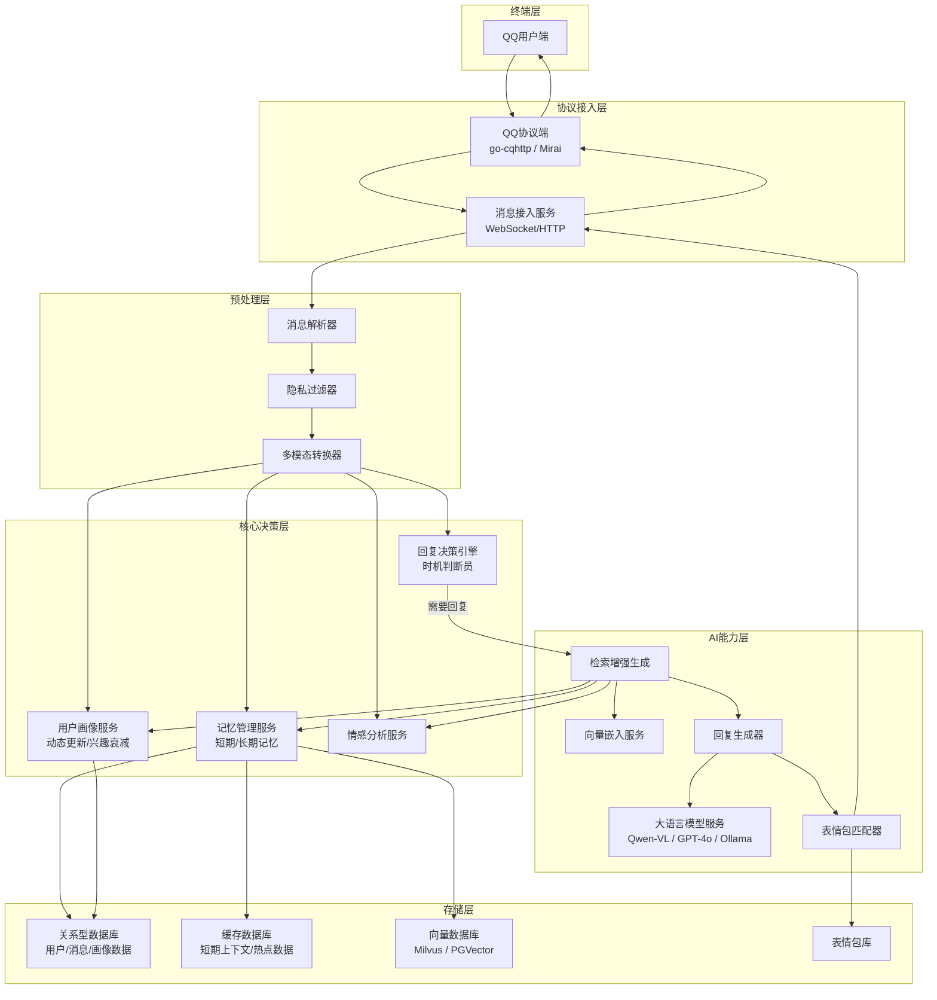
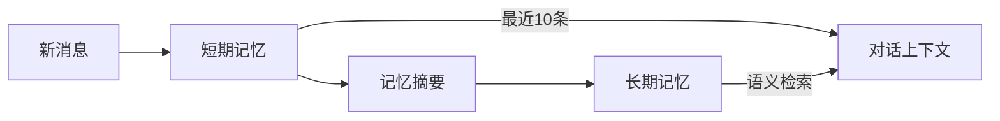
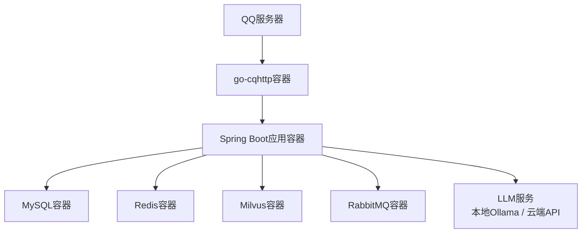

# Spring AI QQ群机器人详细架构设计

## 一、项目概述与目标

### 1.1 项目背景

随着大模型技术的发展，传统的 QQ 群机器人已经无法满足用户的个性化交互需求，传统机器人通常只能实现规则化的指令回复，缺乏长期记忆、情感理解和个性化交互能力，无法像真人一样融入群聊。

本项目旨在基于 Java Spring AI 框架，构建一个高度拟人化的 QQ 群智能 Agent 机器人，能够像真实群成员一样参与群聊，具备长期记忆、表情包理解与发送、情感互动、用户画像感知等核心能力，实现真正的 "真人级" 交互体验。

### 1.2 核心功能目标

|功能模块|具体能力|
|---|---|
|**长期记忆**|能够记住群内用户数月前的对话内容、个人偏好，跨会话保留上下文，不会随对话轮次增加而遗忘|
|**表情包交互**|能够读懂用户发送的表情包的语义与情绪，同时能够根据对话场景自动发送匹配的表情包，丰富交互体验|
|**情感互动**|能够感知用户的情绪状态，调整回复的语气与内容，提供情感支持，比如在用户难过时给予安慰，开心时一起分享喜悦|
|**用户画像感知**|自动从对话中提取用户的性别、年龄、性格、爱好、职业身份等信息，动态更新用户认知，实现千人千面的个性化回复|
|**拟人化交互**|能够自主判断发言时机，不会随意插话，能够主动参与话题讨论，像真人一样自然融入群聊，避免机械感|
---

## 二、整体架构总览

本项目采用分层模块化架构，基于 Spring Boot + Spring AI 生态构建，整体分为 6 个核心层次，实现了高内聚低耦合的设计，保证系统的可扩展性与可维护性。


### 2.1 层次职责说明

1. **协议接入层**：负责与 QQ 客户端的通信，处理消息的接收与发送，屏蔽底层 QQ 协议的细节，提供统一的消息接入接口

2. **预处理层**：对原始消息进行解析、隐私过滤、多模态转换，将不同类型的消息（文本、图片、表情包）转换为 AI 可处理的统一格式

3. **核心决策层**：系统的大脑，负责判断是否需要回复、更新用户画像、管理记忆、分析情感，是实现拟人化交互的核心

4. **AI 能力层**：基于 Spring AI 封装的 AI 能力，包括大模型调用、向量嵌入、RAG 检索、回复生成、表情包匹配等

5. **存储层**：负责所有数据的持久化存储，包括结构化数据、缓存数据、向量数据、表情包资源等

---

## 三、核心模块详细设计

### 3.1 消息接入模块

#### 3.1.1 技术选型

采用**go-cqhttp**作为 QQ 协议端，这是目前最成熟稳定的第三方 QQ 协议实现，支持反向 WebSocket 与 HTTP API，能够完美适配 Spring Boot 应用。

- 优势：成熟稳定、社区活跃、支持多种消息类型、配置简单

- 通信方式：采用反向 WebSocket 模式，go-cqhttp 主动连接 Spring Boot 应用的 WebSocket 端点，实现消息的实时推送

- 消息发送：通过 HTTP API 调用 go-cqhttp 的接口，实现文本、图片、表情包的发送

#### 3.1.2 模块职责

- 消息接收：监听 WebSocket 连接，接收 go-cqhttp 推送的群消息、私聊消息

- 消息发送：封装 HTTP 请求，将生成的回复内容发送到 QQ 端

- 事件处理：处理群成员变动、禁言、加群等事件，同步更新用户状态

- 异常重试：对消息发送失败的情况进行自动重试，保证消息可达性

### 3.2 消息预处理模块

#### 3.2.1 消息解析

- 对原始消息进行解析，提取消息 ID、群 ID、发送者 ID、发送者昵称、消息类型、消息内容等核心字段

- 支持文本、图片、语音、表情包、文件等多种消息类型的解析

- 对 @消息进行识别，标记是否 @了机器人，作为回复决策的重要依据

#### 3.2.2 隐私过滤

参考 GroupGPT 的隐私保护机制，对消息中的敏感信息进行匿名化处理：

- 识别手机号、邮箱、地址、身份证号等敏感信息

- 将具体的敏感信息替换为泛化描述，比如将 "北京市朝阳区 XX 街道 123 号" 替换为 "某个城市的住宅区"

- 既保留了对话的语义，又保护了用户的隐私，避免敏感信息泄露到大模型服务

#### 3.2.3 多模态转换

- 对于文本消息：直接转换为标准文本格式

- 对于图片 / 表情包：将图片转换为 Base64 编码，封装为 Spring AI 的 Media 对象，供多模态模型处理

- 对于语音消息：调用语音转文字服务，将语音转换为文本，同时保留原始语音的情绪特征

### 3.3 回复决策模块（核心难点 1：回复策略）

这是实现拟人化交互的核心模块，负责判断当前消息是否需要机器人回复，解决 "什么时候说话" 的问题，避免瞎插嘴或者过于沉默。

本模块参考华东师范大学 GroupGPT 的时机判断机制，结合规则与模型判断，实现了 86.3% 准确率的发言时机判断。

#### 3.3.1 触发规则判断（前置快速过滤）

首先通过轻量级的规则判断，快速过滤掉不需要回复的场景，降低计算成本：

1. **@触发**：如果消息中 @了机器人，必须回复

2. **提问触发**：如果消息是提问句式，并且指向机器人（比如 "小 Q，你觉得这个怎么样？"），必须回复

3. **引用触发**：如果消息引用了机器人之前的回复，必须回复

4. **管理员触发**：如果是群管理员发送的消息，优先判断是否需要回复

5. **冷场触发**：如果群内超过 5 分钟没有新消息，用户发送了新消息，主动回复活跃气氛

#### 3.3.2 时机判断模型

对于规则无法判断的场景，调用轻量级的时机判断模型，判断是否需要主动插话：

- 输入：最近 20 条群聊消息、群活跃度、用户活跃度

- 输出：是否需要回复，以及回复的类型

- 支持六种干预类型判断：

|    干预类型|    适用场景|
|---|---|
|    **保持沉默**|    群聊话题机器人不了解，或者用户正在私聊，不需要插话|
|    **情感支持**|    用户分享难过的事情，需要安慰；或者群里气氛沉闷，需要活跃气氛|
|    **提供建议**|    用户遇到问题，询问解决方案，机器人可以提供建议|
|    **事实纠正**|    群里有人说错了事实，机器人可以温和地纠正|
|    **知识丰富**|    群聊的话题机器人有相关的知识，可以补充相关内容，让对话更丰富|
|    **风格平衡**|    群里出现冲突，机器人可以调解矛盾，缓解紧张气氛|
#### 3.3.3 活跃度感知

- 统计群内每分钟的消息数量，判断群聊的热闹程度

- 如果群聊非常热闹（每分钟超过 10 条消息），机器人减少插话频率，避免打扰用户

- 如果群聊比较冷清，机器人适当增加互动，活跃气氛

- 记录用户的活跃度，对活跃用户的消息优先处理

#### 3.3.4 话题相关性判断

- 将当前的消息向量化，检索向量数据库中机器人相关的记忆

- 如果当前话题与机器人的知识、之前的对话高度相关（相似度超过阈值），则主动参与话题

- 比如之前用户提到过喜欢养猫，当群里聊到养猫的话题时，机器人主动接话："对了，之前 XX 说过他家的猫很调皮，是不是也会这样？"

### 3.4 用户画像模块（核心难点 2：用户画像上下文提取）

负责从对话中自动提取用户的属性，动态更新用户的认知，实现对用户的全面感知，支持千人千面的个性化回复。

#### 3.4.1 用户画像标签体系

我们构建了多维度的用户画像标签体系，覆盖用户的各个方面：

|维度|具体标签|
|---|---|
|**基础属性**|性别、年龄范围、职业、身份（学生 / 职场人 / 群主 / 管理员）|
|**性格特征**|外向 / 内向、乐观 / 悲观、理性 / 感性、幽默 / 严肃|
|**兴趣爱好**|游戏、运动、数码、美食、旅游、宠物、影视等，带权重与时间戳|
|**行为特征**|活跃时间段、聊天频率、常用语气、偏好的互动方式|
#### 3.4.2 自动提取机制

- 每次用户发送消息后，异步调用大模型，从当前的对话中提取用户的相关信息

- 采用 Prompt 工程，引导大模型输出结构化的 JSON 格式的用户属性更新

- 示例 Prompt：

```Plain Text

你是一个用户画像提取专家，请从以下用户的对话中，提取用户的相关信息，输出JSON格式的结果，只输出有变化的信息：
用户消息：{用户消息}
当前用户画像：{当前的用户画像}

输出格式：
{
  "gender": "男", // 如果提取到性别
  "age_range": "20-25", // 如果提取到年龄范围
  "hobbies": [{"name": "养猫", "weight": 1.0, "timestamp": 1712345678}], // 新增的爱好
  "personality": "外向幽默" // 如果提取到性格
}
如果没有提取到新的信息，输出{}
```

#### 3.4.3 动态更新与兴趣衰减

传统的静态标签会过期，我们采用动态更新机制，让用户画像随时间流动：

1. **实时更新**：每次用户有新的行为，实时更新用户的标签，比如用户最近开始聊旅游，就新增旅游的爱好

2. **兴趣衰减机制**：采用时间衰减函数，让旧的兴趣权重随时间降低，模拟人类的记忆遗忘：

    ```Plain Text
    
    w(t) = w0 * e^(-λt)
    ```

    - w0：兴趣的初始权重

    - λ：衰减系数，不同类型的兴趣衰减系数不同，比如短期兴趣 λ=0.1 / 天，长期兴趣 λ=0.01 / 天

    - t：距离当前的时间间隔（天）

3. **遗忘机制**：当某个标签的权重低于阈值（比如 0.05），自动从用户画像中移除，模拟人类忘记旧的兴趣

4. **兴趣转移推理**：当用户的兴趣发生变化时，自动生成兴趣转移的叙事，比如从 "母婴用户" 转变为 "亲子旅行规划者"

#### 3.4.4 画像存储

- 用户画像的结构化数据存储在 MySQL 中，支持快速读写

- 用户画像的文本描述会进行向量化，存储在向量数据库中，用于个性化的检索

- 每个用户的画像都有独立的命名空间，实现用户之间的隔离

### 3.5 记忆管理模块（核心难点 3：向量存取策略）

负责管理机器人的长期记忆，实现跨会话的上下文保留，让机器人能够记住用户很久之前说过的话。

我们采用分层记忆架构，模拟人类的记忆机制，分为短期记忆和长期记忆：

#### 3.5.1 分层记忆架构


1. **短期记忆（工作记忆）**

    - 存储最近的 10-20 条群聊消息，保留即时的对话上下文

    - 存储在 Redis 中，设置过期时间，保证快速访问

    - 用于处理当前的多轮对话，保证对话的连贯性

2. **长期记忆（语义记忆）**

    - 对超过短期记忆窗口的消息，进行摘要与向量化，存储到向量数据库中

    - 用于存储用户的个人信息、偏好、历史对话的核心内容

    - 支持跨会话的记忆检索，实现长期记忆

#### 3.5.2 向量存取策略

##### [3.5.2.1](3.5.2.1) 写入策略

1. **分块策略**

    - 按用户 + 时间窗口进行分块，将同一个用户在一段时间内的对话合并为一个块

    - 每个块的大小控制在 512-1024token，保证向量的语义完整性

    - 避免单个块过大或者过小，影响检索的准确性

2. **向量化**

    - 调用 Spring AI 的 EmbeddingModel，将分块后的文本转换为向量

    - 支持多模态向量，对于包含图片的记忆，使用多模态嵌入模型，将文本和图片一起转换为向量

    - 写入向量数据库时，附带元数据：用户 ID、群 ID、时间戳、消息 ID 等，用于过滤

3. **批量写入**

    - 采用异步批量写入的方式，避免频繁的数据库操作，提升性能

    - 消息处理完成后，异步提交记忆写入任务，不影响消息的响应速度

##### [3.5.2.2](3.5.2.2) 检索策略

1. **混合检索**

    - 首先将当前的用户消息向量化，作为查询向量

    - 在向量数据库中，检索与当前消息最相关的 top10 的记忆块

    - 同时通过元数据过滤，只检索当前群、当前用户的记忆，保证记忆的隔离

2. **重排序**

    - 对检索到的记忆块，进行重排序，结合时间权重，最近的记忆权重更高

    - 过滤掉权重过低的过期记忆，保证检索到的记忆是相关且有效的

3. **上下文注入**

    - 将检索到的记忆，转换为文本，注入到 Prompt 的系统消息中，作为大模型的上下文

    - 示例：

    ```Plain Text
    
    以下是你和用户的历史记忆，你可以参考这些信息来回复用户：
    - 2024-01-01，用户说他养了一只英短猫，叫小白
    - 2024-02-15，用户说他喜欢吃辣的火锅
    ...
    ```

##### [3.5.2.3](3.5.2.3) 更新与过期策略

1. **增量更新**

    - 新的记忆会增量添加到向量数据库中，不会覆盖旧的记忆

    - 对于重复的记忆，自动去重，避免存储冗余数据

2. **过期清理**

    - 定期清理超过 180 天的低权重记忆，避免向量数据库的数据膨胀

    - 对于用户的核心信息（比如性别、职业），不会过期，永久保留

    - 采用 TTL 策略，对短期的记忆自动过期，长期的记忆保留

### 3.6 表情包处理模块

实现表情包的读懂与发送，让交互更生动。

#### 3.6.1 表情包识别（读懂表情包）

- 当用户发送表情包时，调用多模态大模型，对图片进行分析

- 提取表情包的语义内容、情绪类型，比如："这是一个熊猫头表情包，表达了嘲笑的情绪"

- 将表情包的描述转换为文本，加入到对话上下文中，让机器人能够理解表情包的含义

- 支持对 GIF 动图的分析，理解动图的内容

#### 3.6.2 表情包发送

- 构建表情包库，每个表情包都预先标注了标签、情绪类型，比如：

|    表情包 ID|    标签|    情绪|
|---|---|---|
|    1|    熊猫头、嘲笑|    搞笑|
|    2|    小猫、可爱|    开心|
|    3|    捂脸、害羞|    尴尬|
- 当生成回复时，根据回复的内容和情绪，从表情包库中匹配最相关的表情包

- 按照一定的概率随机发送，模拟真人的聊天习惯，不是每句话都发表情包

- 支持根据用户的偏好调整表情包的发送频率，比如用户喜欢发表情包，机器人也多发，用户不喜欢，就少发

### 3.7 情感互动模块

实现情感感知与个性化回复，让机器人更有温度。

#### 3.7.1 情绪感知

- 对用户的消息进行情感分析，识别用户的情绪状态：开心、难过、生气、焦虑、无聊等

- 结合用户的历史情绪状态，判断用户的情绪变化，比如用户最近一直很焦虑，需要更多的情感支持

#### 3.7.2 语气调整

- 根据用户的情绪，调整回复的语气：

    - 用户难过时：使用温柔、安慰的语气

    - 用户开心时：使用活泼、喜悦的语气

    - 用户生气时：使用冷静、安抚的语气

- 根据用户的性格调整语气：

    - 对内向的用户：使用温和、委婉的语气

    - 对外向的用户：使用活泼、幽默的语气

- 根据用户的身份调整语气：

    - 对长辈：使用尊敬的语气

    - 对同龄人：使用轻松的语气

#### 3.7.3 情感支持

- 当检测到用户有负面情绪时，主动提供情感支持，比如用户说 "今天加班好累"，机器人会回复 "辛苦啦，要不要休息一下，要不要点杯奶茶犒劳自己？"

- 当用户分享开心的事情时，主动分享喜悦，比如用户说 "我考试过了！"，机器人会回复 "哇！太棒了！恭喜恭喜！"

### 3.8 回复生成模块

整合所有的上下文信息，生成最终的回复。

#### 3.8.1 上下文整合

- 整合短期记忆的最近对话

- 整合检索到的长期记忆

- 整合用户的画像信息

- 整合情感分析的结果

- 整合群聊的上下文信息

#### 3.8.2 Prompt 工程

构建结构化的 System Prompt，引导大模型生成拟人化的回复：

```Plain Text

你是一个叫做小Q的QQ群成员，你要像真人一样和大家聊天，不要太正式，要口语化。

用户信息：
{用户画像的文本描述}

历史记忆：
{检索到的长期记忆}

最近的对话：
{短期记忆的对话}

当前用户的情绪：{情绪分析结果}
请你根据以上信息，生成自然的回复，要符合你的性格，要贴合上下文，不要暴露你是AI。
```

#### 3.8.3 流式回复

支持流式回复，模拟真人打字的效果，逐字发送回复，避免一次性发送大段文字，更符合真人的聊天习惯。

---

## 四、数据模型设计

### 4.1 用户表（user）

|字段|类型|说明|
|---|---|---|
|user_id|bigint|QQ 用户 ID|
|nickname|varchar|用户昵称|
|gender|varchar|性别，男 / 女 / 未知|
|age_range|varchar|年龄范围|
|occupation|varchar|职业|
|personality|varchar|性格描述|
|active_time|json|活跃时间段|
|create_time|datetime|创建时间|
|update_time|datetime|更新时间|
### 4.2 群成员表（group_member）

|字段|类型|说明|
|---|---|---|
|id|bigint|主键|
|group_id|bigint|群 ID|
|user_id|bigint|用户 ID|
|role|varchar|角色，owner/admin/member|
|join_time|datetime|入群时间|
|chat_count|int|发言次数|
|last_chat_time|datetime|最后发言时间|
### 4.3 用户爱好表（user_hobby）

|字段|类型|说明|
|---|---|---|
|id|bigint|主键|
|user_id|bigint|用户 ID|
|hobby_name|varchar|爱好名称|
|weight|double|权重|
|create_time|datetime|创建时间|
|update_time|datetime|更新时间|
### 4.4 消息表（message）

|字段|类型|说明|
|---|---|---|
|msg_id|bigint|消息 ID|
|group_id|bigint|群 ID|
|user_id|bigint|用户 ID|
|msg_type|varchar|消息类型|
|content|text|消息内容|
|emotion|varchar|情绪类型|
|create_time|datetime|创建时间|
### 4.5 记忆表（memory）

|字段|类型|说明|
|---|---|---|
|id|bigint|主键|
|group_id|bigint|群 ID|
|user_id|bigint|用户 ID|
|content|text|记忆内容|
|embedding|vector|向量|
|create_time|datetime|创建时间|
|expire_time|datetime|过期时间|
### 4.6 表情包表（sticker）

|字段|类型|说明|
|---|---|---|
|id|bigint|主键|
|name|varchar|表情包名称|
|tags|json|标签|
|emotion|varchar|情绪类型|
|file_path|varchar|文件路径|
|file_size|int|文件大小|
---

## 五、技术栈选型

|类别|技术选型|说明|
|---|---|---|
|**核心框架**|Spring Boot 3.2 + Spring AI 1.0|Java 生态的 AI 应用开发框架，提供统一的 AI 接口|
|**QQ 协议**|go-cqhttp|成熟的 QQ 协议实现，支持 WebSocket/HTTP API|
|**大模型**|通义千问 VL / GPT-4o / Ollama|多模态大模型，支持文本与图片理解，可本地部署|
|**嵌入模型**|text-embedding-3-small / 本地 BGE|文本向量嵌入模型|
|**关系型数据库**|MySQL 8.0|存储结构化的用户、消息、画像数据|
|**缓存数据库**|Redis 7.0|存储短期记忆、热点数据，提升访问速度|
|**向量数据库**|Milvus 2.4 / PGVector|存储向量数据，支持高效的相似性检索|
|**消息队列**|RabbitMQ|异步处理用户画像更新、记忆写入等后台任务|
|**监控告警**|Prometheus + Grafana|系统监控，监控接口响应时间、模型调用成本|
---

## 六、部署架构

### 6.1 部署拓扑


### 6.2 部署方式

- 采用 Docker Compose 进行容器化部署，所有服务都打包为容器，一键启动

- 支持水平扩展，当需要支持多个群的时候，可以扩展 Spring Boot 应用的实例

- 配置文件采用环境变量注入，支持不同环境的配置隔离

### 6.3 配置示例

```yaml

# application.yml
spring:
  ai:
    openai:
      api-key: ${OPENAI_API_KEY}
      base-url: https://api.openai.com/v1
      chat:
        model: gpt-4o
      embedding:
        model: text-embedding-3-small
  redis:
    host: redis
    port: 6379
  datasource:
    url: jdbc:mysql://mysql:3306/qq_agent
    username: root
    password: 123456

qq:
  protocol:
    host: go-cqhttp
    port: 8080
    access-token: ${ACCESS_TOKEN}

vector:
  store:
    milvus:
      host: milvus
      port: 19530
      database-name: qq_agent
```

---

## 七、落地实施步骤

### 阶段 1：基础环境搭建（1 周）

1. 搭建开发环境，初始化 Spring Boot 项目，引入 Spring AI 依赖

2. 部署 go-cqhttp，配置反向 WebSocket，测试消息的接收与发送

3. 部署 MySQL、Redis、Milvus 等中间件，初始化数据库表

### 阶段 2：核心模块开发（2 周）

1. 开发消息接入与预处理模块，实现消息的解析与隐私过滤

2. 开发短期记忆模块，实现基础的多轮对话

3. 开发基础的回复规则，实现 @触发的回复功能

### 阶段 3：高级功能开发（3 周）

1. 开发用户画像模块，实现用户属性的自动提取与动态更新

2. 开发长期记忆模块，实现向量存储与检索，集成 RAG 能力

3. 开发回复决策模块，实现主动回复的时机判断

4. 开发表情包处理模块，实现表情包的识别与发送

### 阶段 4：情感与优化（2 周）

1. 开发情感互动模块，实现情绪感知与语气调整

2. 优化 Prompt 工程，提升回复的拟人化程度

3. 开发兴趣衰减机制，优化用户画像的动态更新

4. 优化向量存取策略，提升记忆检索的准确性

### 阶段 5：测试与上线（1 周）

1. 进行内部测试，邀请用户进行群聊测试，收集反馈

2. 调整回复策略的阈值，优化插话的时机

3. 容器化打包，部署到生产环境

4. 监控系统运行状态，处理线上问题

---

## 八、成本与性能优化

### 8.1 成本优化

1. **模型分层调用**：轻量级的任务（比如时机判断、用户画像提取）用小模型，复杂的回复生成用大模型，降低调用成本

2. **缓存机制**：对用户画像、记忆检索的结果进行缓存，避免重复调用模型

3. **异步处理**：用户画像更新、记忆写入等后台任务异步处理，不阻塞主流程

4. **本地部署**：对于隐私要求高的场景，采用本地部署的 Ollama 模型，避免云端 API 的调用成本

### 8.2 性能优化

1. **批量处理**：对记忆的写入进行批量处理，减少数据库的 IO

2. **索引优化**：对向量数据库建立索引，提升检索速度

3. **缓存热点数据**：将活跃用户的画像、最近的消息缓存到 Redis 中，提升访问速度

4. **异步非阻塞**：采用 Spring WebFlux 实现非阻塞的消息处理，提升系统的并发能力

---

## 九、总结

本架构基于 Spring AI 框架，结合了最新的大模型技术、RAG 技术、动态用户画像技术，实现了一个高度拟人化的 QQ 群机器人，解决了传统机器人的回复生硬、缺乏记忆、无法感知用户的问题。

通过分层的模块化设计，系统具备良好的可扩展性与可维护性，能够支持后续的功能扩展，比如添加语音交互、群管理功能等。同时，整个架构是可落地的，所有的技术选型都是成熟稳定的，能够快速开发上线，真正实现像真人一样的群聊交互体验。
> （注：文档部分内容可能由 AI 生成）