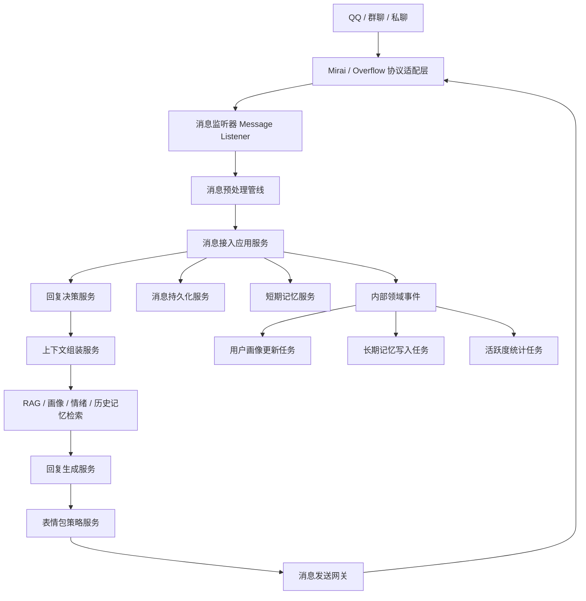

# sheng-bot 开发流程与代码系统架构设计

## 一、文档定位

本文基于以下三部分信息整理：

- `Spring AI QQ群机器人详细架构设计.md`
- `项目依赖说明.md`
- 当前仓库的实际代码结构与依赖现状

本文的目标不是重复“理想功能架构”，而是把理想架构落成一套**可以在当前仓库直接推进实施**的开发流程、目录结构、模块边界和阶段性落地方案。

---

## 二、当前项目现状与核心差距

### 2.1 当前仓库现状

当前项目还处于骨架阶段，代码层面只有 4 个 Java 文件：

- `ShengBotApplication`
- `config/AiConfig`
- `config/BotProperties`
- `config/MiraiConfig`

当前已经具备的能力只有：

- Spring Boot 启动入口
- Spring AI `ChatClient` Bean 装配
- Bot 基础配置读取
- Mirai / Overflow 连接初始化
- MySQL / Redis / Milvus / OpenAI 相关配置项

当前尚未落地的部分包括：

- 消息监听与统一消息模型
- 消息预处理链路
- 回复决策引擎
- 短期记忆 / 长期记忆服务
- 用户画像服务
- 情感分析服务
- 表情包服务
- 持久化实体、Mapper、Repository
- 数据库初始化脚本与迁移机制
- 单元测试、集成测试、回放测试
- 运维监控与发布流程

### 2.2 关键认知修正

为了让后续设计和当前代码一致，需要先统一几个工程事实：

1. 当前项目的协议接入主链路不是 `WebFlux -> WebSocket Controller`，而是 **Mirai + Overflow 的事件回调**。
2. `spring-boot-starter-webflux` 在当前项目更适合作为：
   - 管理端接口
   - SSE / 流式输出
   - 可选的管理型 WebSocket 能力
   而不是消息接入的唯一入口。
3. 当前项目更适合采用 **模块化单体 + 分层架构 + 内部事件驱动**，而不是一开始就拆成微服务。
4. 消息、画像、记忆、情绪、表情包虽然是不同能力，但在当前阶段应该以**单仓单进程协同模块**实现，先完成闭环，再按压力拆分。

---

## 三、推荐的总体架构风格

### 3.1 架构风格

推荐采用：**模块化单体（Modular Monolith） + 领域分层 + 内部异步事件**。

原因如下：

- 当前代码规模很小，直接微服务化会显著增加部署和调试复杂度
- QQ 消息处理链路强耦合，拆服务会导致上下文传递、幂等控制、可观测性变复杂
- 画像、记忆、情绪、回复编排之间共享模型较多，模块化单体更容易保持一致性
- 后续如果群规模变大，再把异步链路抽到 MQ 即可平滑演进

### 3.2 基本分层原则

建议统一遵守以下边界：

- **接口层**：只负责接收外部输入和输出结果，不写业务规则
- **应用层**：编排完整用例，串联多个领域服务
- **领域层**：封装业务规则与核心决策，不依赖外部协议细节
- **基础设施层**：负责 AI、数据库、缓存、向量库、协议 SDK 等适配
- **共享支撑层**：放异常、枚举、工具、JSON、Prompt 模板加载等通用能力

### 3.3 核心工程原则

- 所有 QQ SDK 类型只允许出现在协议适配层，不向业务层泄漏
- 所有 LLM 调用统一收敛到 AI Gateway，不允许业务层直接到处调用 `ChatClient`
- 所有持久化访问通过 Repository / Gateway 抽象，不允许应用层直接操作 Mapper
- 所有异步任务必须按 `messageId` 或 `eventId` 保证幂等
- 所有发给模型的内容必须先走隐私过滤与内容规整
- 所有 Prompt 统一存放在资源目录，不在代码中散落大段字符串

---

## 四、目标代码系统架构

### 4.1 推荐模块关系图



### 4.2 推荐包结构

```text
src
├─ main
│  ├─ java/top/kloping/code
│  │  ├─ bootstrap
│  │  │  ├─ ShengBotApplication.java
│  │  │  └─ StartupHealthCheck.java
│  │  ├─ config
│  │  │  ├─ AiConfig.java
│  │  │  ├─ BotProperties.java
│  │  │  ├─ MiraiConfig.java
│  │  │  ├─ RedisConfig.java
│  │  │  ├─ MilvusConfig.java
│  │  │  ├─ MybatisPlusConfig.java
│  │  │  ├─ AsyncExecutorConfig.java
│  │  │  └─ JacksonConfig.java
│  │  ├─ common
│  │  │  ├─ constants
│  │  │  ├─ enums
│  │  │  ├─ exception
│  │  │  ├─ util
│  │  │  └─ json
│  │  ├─ interfaces
│  │  │  ├─ qq
│  │  │  │  ├─ listener
│  │  │  │  ├─ sender
│  │  │  │  ├─ converter
│  │  │  │  └─ dto
│  │  │  ├─ admin
│  │  │  │  ├─ controller
│  │  │  │  └─ dto
│  │  │  └─ scheduler
│  │  ├─ application
│  │  │  ├─ ingress
│  │  │  ├─ conversation
│  │  │  ├─ reply
│  │  │  ├─ memory
│  │  │  ├─ profile
│  │  │  ├─ emotion
│  │  │  ├─ sticker
│  │  │  └─ event
│  │  ├─ domain
│  │  │  ├─ message
│  │  │  │  ├─ model
│  │  │  │  ├─ service
│  │  │  │  └─ event
│  │  │  ├─ decision
│  │  │  ├─ conversation
│  │  │  ├─ memory
│  │  │  ├─ profile
│  │  │  ├─ emotion
│  │  │  ├─ sticker
│  │  │  └─ persona
│  │  ├─ infrastructure
│  │  │  ├─ protocol
│  │  │  │  └─ mirai
│  │  │  ├─ ai
│  │  │  │  ├─ chat
│  │  │  │  ├─ embedding
│  │  │  │  ├─ prompt
│  │  │  │  ├─ rag
│  │  │  │  └─ mcp
│  │  │  ├─ persistence
│  │  │  │  ├─ mysql
│  │  │  │  │  ├─ entity
│  │  │  │  │  ├─ mapper
│  │  │  │  │  └─ repository
│  │  │  │  ├─ redis
│  │  │  │  └─ vector
│  │  │  ├─ multimodal
│  │  │  ├─ metrics
│  │  │  └─ eventbus
│  │  └─ support
│  │     ├─ prompt
│  │     ├─ rate_limit
│  │     └─ validation
│  └─ resources
│     ├─ application.yml
│     ├─ application-dev.yml
│     ├─ prompts
│     ├─ db/migration
│     ├─ stickers
│     └─ banner.txt
└─ test
   ├─ java/top/kloping/code
   │  ├─ unit
   │  ├─ integration
   │  ├─ replay
   │  └─ support
   └─ resources
      ├─ fixtures
      └─ messages
```

### 4.3 各层职责说明

|层|职责|是否允许依赖外部框架细节|
|---|---|---|
|`interfaces`|接收 QQ 事件、管理接口、定时入口|允许|
|`application`|编排用例、事务边界、发布领域事件|允许少量 Spring 依赖|
|`domain`|回复策略、画像规则、记忆规则、情绪规则|尽量不依赖|
|`infrastructure`|AI、MySQL、Redis、Milvus、Mirai 适配|允许|
|`common/support`|工具、异常、常量、Prompt、校验|允许|

---

## 五、推荐的核心类职责划分

### 5.1 协议接入与消息标准化

建议优先创建以下类：

- `interfaces.qq.listener.GroupMessageListener`
- `interfaces.qq.listener.PrivateMessageListener`
- `interfaces.qq.converter.IncomingMessageAssembler`
- `interfaces.qq.sender.OutboundMessageGateway`
- `domain.message.model.IncomingMessage`
- `domain.message.model.MessageContent`
- `domain.message.model.MessageContext`

这一层的目标是把 Mirai / Overflow 的消息对象统一转成项目自己的标准消息模型，后面的业务层一律不感知 QQ SDK 类型。

### 5.2 预处理与消息接入应用服务

建议优先创建：

- `application.ingress.MessageIngressApplicationService`
- `application.ingress.MessagePreprocessPipeline`
- `application.ingress.PrivacyFilter`
- `application.ingress.AtMentionDetector`
- `application.ingress.MultiModalNormalizer`

职责是把原始消息加工成“可决策、可持久化、可向量化”的统一输入。

### 5.3 回复决策与上下文组装

建议优先创建：

- `domain.decision.ReplyDecisionService`
- `domain.decision.RuleBasedDecisionPolicy`
- `application.reply.ReplyOrchestrator`
- `application.reply.ContextAssemblyService`
- `application.reply.PersonaPromptBuilder`

职责是解决两个关键问题：

- 该不该回复
- 回复时模型应该拿到哪些上下文

### 5.4 记忆与画像

建议优先创建：

- `application.memory.ShortTermMemoryApplicationService`
- `application.memory.LongTermMemoryApplicationService`
- `domain.memory.MemoryChunkPolicy`
- `application.profile.UserProfileApplicationService`
- `domain.profile.ProfileDecayPolicy`

职责分工：

- Redis 负责最近消息窗口、上下文缓存、活跃度缓存
- MySQL 负责结构化事实数据
- Milvus 负责长期语义记忆

### 5.5 AI 与 Prompt 适配层

建议优先创建：

- `infrastructure.ai.chat.SpringAiChatGateway`
- `infrastructure.ai.embedding.SpringAiEmbeddingGateway`
- `infrastructure.ai.rag.MemoryRetrievalGateway`
- `support.prompt.PromptTemplateLoader`
- `support.prompt.PromptVariablesAssembler`

这一层统一处理：

- 模型调用
- Prompt 模板装载
- JSON 输出解析
- RAG 检索
- 模型失败重试与降级

---

## 六、完整业务链路设计

### 6.1 同步主链路：消息接收 -> 决策 -> 回复

建议按以下顺序实现：

1. 协议监听器接收群消息 / 私聊消息
2. 转换成统一 `IncomingMessage`
3. 执行黑名单、白名单、群配置、私聊配置过滤
4. 执行文本规整、@识别、引用识别、隐私过滤、多模态规整
5. 写入消息流水表与短期记忆缓存
6. 执行规则判断是否必须回复
7. 如规则无法确定，则进入时机判断或轻模型判断
8. 如果判定不回复，则主链路结束，只发布异步事件
9. 如果需要回复，则组装上下文：
   - 最近会话
   - 用户画像
   - 长期记忆
   - 情绪状态
   - 群上下文
10. 调用 LLM 生成回复
11. 根据语气与场景匹配表情包或图片
12. 通过 `OutboundMessageGateway` 发送消息
13. 记录回复结果、耗时、失败原因、模型消耗

### 6.2 异步支链路：画像 / 长期记忆 / 活跃度统计

建议使用内部事件驱动：

- `MessageReceivedEvent`
- `ReplyGeneratedEvent`
- `ProfileUpdateRequestedEvent`
- `LongTermMemoryWriteRequestedEvent`
- `GroupActivityUpdatedEvent`

V1 阶段建议直接使用：

- `ApplicationEventPublisher`
- `@Async`
- 独立线程池

V2 阶段如果消息量上来，再引入 RabbitMQ，而不是一开始就上 MQ。

### 6.3 错误处理与幂等设计

必须提前约束以下规则：

- 同一 `messageId` 的写库、记忆写入、画像更新要可幂等
- 模型 JSON 输出必须经过结构化校验，失败时走兜底策略
- 向量写入失败不能影响主回复链路
- 发消息失败需要记录可重试任务，但避免重复轰炸群聊
- 模型调用超时要有降级回复或静默策略

---

## 七、依赖与模块映射建议

### 7.1 现有依赖与目标模块映射

|依赖|用途|建议归属模块|阶段|
|---|---|---|---|
|`overflow-core`|QQ 协议连接与事件|`interfaces.qq` + `infrastructure.protocol.mirai`|P1|
|`mirai-core-all`|Mirai 协议基础|`infrastructure.protocol.mirai`|P1|
|`spring-ai-starter-model-openai`|Chat / Embedding 能力|`infrastructure.ai`|P2-P4|
|`spring-ai-starter-vector-store-milvus`|长期记忆向量检索|`infrastructure.persistence.vector`|P3|
|`mybatis-plus-spring-boot3-starter`|结构化持久化|`infrastructure.persistence.mysql`|P2|
|`spring-boot-starter-data-redis`|短期记忆与缓存|`infrastructure.persistence.redis`|P2|
|`okhttp`|外部媒体拉取、可选协议辅助请求|`infrastructure.multimodal`|P4|
|`spring-boot-starter-webflux`|管理端接口 / SSE / 扩展接口|`interfaces.admin`|P5|
|`spring-ai-pdf-document-reader`|知识库文档导入|`infrastructure.ai.rag`|P5|
|`spring-ai-tika-document-reader`|多格式文档导入|`infrastructure.ai.rag`|P5|
|`kloping-ai-mcp`|外部工具扩展|`infrastructure.ai.mcp`|P5|
|`jsoup`|网页抓取与清洗|`infrastructure.ai.mcp` / `infrastructure.multimodal`|P5|
|`cron-utils`|定时清理、记忆维护|`interfaces.scheduler`|P4|

### 7.2 建议尽快补充的工程依赖

建议按阶段增加以下依赖，而不是一次性全部塞进 `pom.xml`：

- `spring-boot-starter-test`
- `spring-boot-starter-validation`
- `spring-boot-starter-actuator`
- `micrometer-registry-prometheus`
- `flyway-core`
- `resilience4j-spring-boot3`

### 7.3 依赖治理建议

- **JSON 统一**：内部统一使用 Jackson，Fastjson / Gson 仅保留兼容用途
- **配置分层**：基础配置进 `application.yml`，本地私密配置保留在被忽略文件，生产环境全部走环境变量
- **向量与关系库职责分离**：不要把“事实数据”只存 Milvus，结构化事实必须进 MySQL
- **AI 调用收口**：不要在多个 Service 中散落模型调用代码

---

## 八、完整开发流程设计

### 8.1 单个功能的标准开发流程

每开发一个能力模块，都建议按下面的顺序推进：

1. **需求定义**
   - 明确功能目标、触发条件、输入输出、失败策略
2. **领域建模**
   - 先定义领域对象、领域规则、状态流转，再写适配器
3. **接口契约设计**
   - 定义 DTO、Repository、Gateway、事件模型
4. **基础设施实现**
   - 接入 AI、Redis、MySQL、Milvus、Mirai 等外部能力
5. **应用服务编排**
   - 串联完整用例，控制事务和异步事件发布
6. **测试验证**
   - 单元测试、集成测试、消息回放测试、人工群聊验证
7. **配置与文档更新**
   - 更新配置项、Prompt 模板、数据库迁移、操作文档
8. **发布与回滚准备**
   - 输出发布说明、关键观察指标、失败回滚方案

### 8.2 阶段化落地路线图

|阶段|目标|核心输出|完成标准|
|---|---|---|---|
|P0 基线治理|把仓库从“骨架”整理成可持续开发结构|分层目录、测试目录、统一异常、日志规范、配置模板|项目可稳定启动，目录边界清晰|
|P1 协议接入闭环|实现 QQ 收消息与发消息闭环|监听器、消息标准模型、发送网关、基础过滤|机器人可在测试群完成收发闭环|
|P2 预处理与短期记忆|完成消息清洗、缓存上下文、消息持久化|预处理链、Redis 短期记忆、消息表、群配置过滤|支持基础多轮对话与消息审计|
|P3 长期记忆与用户画像|实现 MySQL + Milvus 的双存储|画像表、爱好表、长期记忆写入与检索|能根据历史偏好生成更个性化回复|
|P4 决策引擎与回复编排|解决“该不该回”“怎么回”|规则策略、轻模型决策、上下文组装、Prompt 模板|回复自然，且不频繁乱插话|
|P5 多模态、表情包、情绪互动|增强拟人化体验|图片理解、表情包匹配、情绪感知、管理接口|支持图片语义理解与情绪化回复|
|P6 观测、压测与上线|面向生产运维|Actuator、Prometheus 指标、重试与限流、发布脚本|具备稳定上线与问题排查能力|

### 8.3 每个阶段的最小验收标准

每个阶段至少满足以下四类要求：

- **功能通过**：核心主路径可运行
- **日志可读**：关键节点日志可定位问题
- **配置可控**：新增配置项有默认值或示例
- **测试可回归**：有基础自动化验证或回放样例

---

## 九、建议的测试体系

### 9.1 测试分层

建议建立四层测试：

- `unit`：纯规则、纯策略、纯装配逻辑
- `integration`：MySQL / Redis / Milvus / AI Gateway 集成验证
- `replay`：真实群聊消息回放，验证回复策略是否符合预期
- `manual`：测试群人工验收，重点看拟人化与打扰度

### 9.2 优先测试对象

优先为以下模块补测试：

- `ReplyDecisionService`
- `PrivacyFilter`
- `IncomingMessageAssembler`
- `ShortTermMemoryApplicationService`
- `ContextAssemblyService`
- `UserProfileApplicationService`

### 9.3 LLM 场景测试原则

LLM 场景不要只写“字符串全量匹配”测试，而要测试：

- 是否调用了正确的上下文来源
- 是否包含必要的用户画像与历史记忆
- 是否满足长度、语气、是否回复等约束
- JSON 输出是否可解析、可兜底

---

## 十、建议优先落地的首批文件

如果按当前仓库状态推进，建议第一批优先新增以下文件：

1. `domain/message/model/IncomingMessage.java`
2. `interfaces/qq/converter/IncomingMessageAssembler.java`
3. `interfaces/qq/listener/GroupMessageListener.java`
4. `interfaces/qq/sender/OutboundMessageGateway.java`
5. `application/ingress/MessageIngressApplicationService.java`
6. `application/ingress/MessagePreprocessPipeline.java`
7. `domain/decision/ReplyDecisionService.java`
8. `application/reply/ReplyOrchestrator.java`
9. `infrastructure/persistence/redis/RedisShortTermMemoryRepository.java`
10. `infrastructure/persistence/mysql/mapper/MessageMapper.java`
11. `src/main/resources/prompts/reply-system.md`
12. `src/main/resources/db/migration/V1__init_schema.sql`
13. `src/test/java/top/kloping/code/unit/decision/ReplyDecisionServiceTest.java`

---

## 十一、仓库级开发规范

建议从第一阶段就固定以下规范：

- 不允许在业务层直接使用 Mirai 类型
- 不允许在多个 Service 中直接拼接 Prompt
- 不允许跳过迁移脚本直接手改数据库结构
- 不允许把敏感配置写入可提交文件
- 不允许把“主回复链路”和“异步画像/记忆链路”混在一个超大 Service 中
- 不允许把“规则判断”和“模型判断”写成一段不可测试的流程代码

---

## 十二、结论

对当前 `sheng-bot` 项目，最合适的落地路径不是继续堆功能点，而是先把“协议接入、消息标准化、应用编排、领域规则、存储适配、Prompt 管理、测试体系”这几条主骨架搭起来。

因此，推荐的建设顺序是：

1. 先完成模块化单体的目录重构
2. 再完成消息收发闭环与短期记忆
3. 然后补长期记忆、画像、决策引擎
4. 最后增强多模态、表情包、监控和运维能力

这样既能保持与现有 `pom.xml`、`application.yml`、Mirai/Overflow 配置一致，又能把理想架构平滑落到当前仓库中，形成一套真正可执行的开发流程与代码系统架构。
