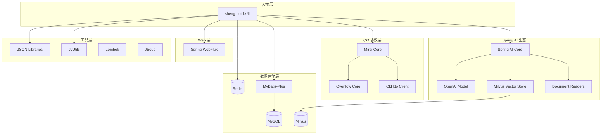

# sheng-bot 项目依赖说明

## 一、项目概述

**项目名称**: sheng-bot  
**版本**: 0.1  
**构建工具**: Maven  
**Java 版本**: JDK 21  
**Spring Boot 版本**: 3.5.9  
**Spring AI 版本**: 1.1.3  

 本项目是一个基于 Spring AI 的 QQ 群智能机器人，具备长期记忆、表情包理解与发送、情感互动、用户画像感知等核心能力。

 补充说明：

 - 本文聚焦“依赖用途、版本和工程注意事项”
 - 完整的“开发流程 + 代码系统架构”请参见 `开发流程与代码系统架构设计.md`

---

## 二、依赖分类说明

### 2.1 核心框架依赖

#### Spring Boot 父工程
- **spring-boot-starter-parent**: 3.5.9
  - 提供 Spring Boot 的基础配置和依赖管理
  - 统一管理常用依赖的版本号

#### Spring AI 相关
- **spring-ai-bom**: 1.1.3 (BOM)
  - Spring AI 的依赖管理清单，统一管理 Spring AI 生态组件版本
  
- **spring-ai-starter-model-openai**
  - OpenAI 模型集成（支持通义千问、GPT 等兼容 OpenAI API 的模型）
  - 提供 ChatClient、EmbeddingModel 等核心 AI 接口
  
- **spring-ai-pdf-document-reader**
  - PDF 文档读取器，支持从 PDF 文件中提取文本内容
  - 用于 RAG（检索增强生成）场景中的文档处理
  
- **spring-ai-tika-document-reader**
  - Apache Tika 文档读取器，支持多种文档格式（Word、Excel、PPT 等）
  - 扩展文档处理能力
  
- **spring-ai-starter-vector-store-milvus**
  - Milvus 向量数据库集成
  - 用于长期记忆的向量存储和语义检索

### 2.2 QQ 协议接入层

#### Mirai 框架
- **mirai-core-all**: 2.16.0
  - Mirai QQ 机器人框架核心库
  - 提供 QQ 协议的完整实现
  - 排除 mirai-core-jvm 以避免冲突
  
- **overflow-core**: 1.1.0
  - Mirai 的溢出核心库（top.mrxiaom.mirai）
  - 增强 Mirai 的功能和稳定性

#### HTTP 客户端
- **okhttp**: 4.12.0
  - Square 公司开发的 HTTP 客户端
  - 用于调用 QQ 协议 API 和其他网络请求

### 2.3 数据存储层

#### 关系型数据库
- **mybatis-plus-spring-boot3-starter**: 3.5.8
  - MyBatis-Plus 增强工具，简化数据库操作
  - 提供 CRUD 封装、分页、条件构造器等便捷功能
  
- **mysql-connector-java**: 8.0.33
  - MySQL 数据库驱动
  - 连接 MySQL 8.0 数据库

#### 缓存数据库
- **spring-boot-starter-data-redis**
  - Spring Data Redis 集成
  - 用于短期记忆、热点数据缓存
  
- **jedis**
  - Redis Java 客户端
  - 提供高性能的 Redis 连接和操作

### 2.4 Web 与响应式编程

- **spring-boot-starter-webflux**
  - Spring WebFlux 响应式 Web 框架
  - 在当前项目中更适合作为管理端接口、SSE/流式输出与扩展集成能力
  - 当前 QQ 消息主接入链路仍以 Mirai / Overflow 事件回调为主，而非 WebFlux Controller

### 2.5 数据处理与工具类

#### JSON 处理
- **fastjson**: 1.2.83
  - 阿里巴巴开源的 JSON 处理库
  - 高性能的 JSON 序列化和反序列化
  
- **gson**: 2.11.0
  - Google 的 JSON 处理库
  - 提供灵活的 JSON 转换能力
  
- **jackson-databind**
  - Jackson JSON 处理库
  - Spring Boot 默认的 JSON 处理器

#### 网页解析
- **jsoup**: 1.17.2
  - Java HTML 解析器
  - 用于网页内容抓取和解析

#### 通用工具
- **JvUtils**: 0.4.9-Beta2
  - 通用 Java 工具类库（io.github.kloping）
  - 提供字符串、集合、日期等常用工具方法

#### 定时任务
- **cron-utils**: 9.2.1
  - Cron 表达式工具库
  - 用于定时任务的调度和管理

#### Maven 解析
- **maven-resolver-spi**: 1.7.3
  - Maven 依赖解析 SPI 接口
  - 可能用于动态加载插件或依赖

### 2.6 AI MCP 集成

- **kloping-ai-mcp**: 0.0.6
  - AI Model Context Protocol 集成
  - 排除 spring-ai-mcp 避免版本冲突
  - 提供更丰富的 AI 上下文管理能力

### 2.7 开发辅助

- **lombok**
  - Java 代码简化工具
  - 自动生成 getter/setter、构造函数、日志等样板代码

### 2.8 日志桥接

- **jcl-over-slf4j**
  - 将 Jakarta Commons Logging 桥接到 SLF4J
  
- **log4j-over-slf4j**
  - 将 Log4j 桥接到 SLF4J
  - 统一日志输出到 SLF4J，便于日志管理

---

## 三、依赖架构图



---

## 四、关键依赖版本对照表

| 依赖类别 | 组件名称 | 版本号 | 用途说明 |
|---------|---------|--------|---------|
| **核心框架** | Spring Boot | 3.5.9 | 基础框架 |
| | Spring AI | 1.1.3 | AI 能力封装 |
| | JDK | 21 | Java 运行环境 |
| **QQ 协议** | Mirai Core | 2.16.0 | QQ 协议实现 |
| | Overflow Core | 1.1.0 | Mirai 增强库 |
| | OkHttp | 4.12.0 | HTTP 客户端 |
| **数据库** | MyBatis-Plus | 3.5.8 | ORM 框架 |
| | MySQL Connector | 8.0.33 | MySQL 驱动 |
| | Jedis | (由 Spring Boot 管理) | Redis 客户端 |
| **AI 模型** | Spring AI OpenAI | 1.1.3 | 大模型集成 |
| | Spring AI Milvus | 1.1.3 | 向量数据库 |
| | Spring AI Document Readers | 1.1.3 | 文档处理 |
| **JSON 处理** | Fastjson | 1.2.83 | 阿里 JSON 库 |
| | Gson | 2.11.0 | Google JSON 库 |
| | Jackson | (由 Spring Boot 管理) | Spring 默认 JSON |
| **其他工具** | JSoup | 1.17.2 | HTML 解析 |
| | JvUtils | 0.4.9-Beta2 | 通用工具类 |
| | Cron Utils | 9.2.1 | 定时任务 |
| | kloping-ai-mcp | 0.0.6 | AI MCP 集成 |

---

## 五、依赖使用场景说明

### 5.1 消息接收与发送流程

```
QQ 用户 → Mirai/Overflow 事件回调 → 消息监听器 / 消息转换器 → 业务逻辑
                                                             ↓
                                                      Spring AI → LLM
                                                             ↓
 业务逻辑 ← JSON 处理 ← 响应生成 ← 记忆检索 ← Milvus/Redis/MySQL
     ↓
 消息发送网关 → Mirai/Overflow → QQ 用户
```

### 5.2 记忆管理流程

```
新消息 → 短期记忆(Redis) → 摘要处理 → 向量化(Spring AI Embedding)
                                              ↓
                                        长期记忆(Milvus)
                                              ↓
用户查询 → 向量检索 → 重排序 → 注入 Prompt → LLM 生成回复
```

### 5.3 用户画像更新流程

```
用户消息 → 异步任务 → LLM 提取属性 → JSON 解析(Fastjson/Gson)
                                            ↓
                                    动态更新(MySQL + 兴趣衰减)
                                            ↓
                                    向量化存储(Milvus)
```

---

## 六、依赖注意事项

### 6.1 版本兼容性

1. **Spring Boot 3.x 要求 JDK 17+**
   - 本项目使用 JDK 21，完全兼容
   
2. **Spring AI 1.1.3 与 Spring Boot 3.5.9 兼容**
   - 通过 BOM 统一管理版本，避免冲突

3. **Mirai 2.16.0 是稳定版本**
   - 已排除 mirai-core-jvm 避免重复依赖

### 6.2 安全建议

1. **Fastjson 1.2.83 存在已知漏洞**
   - 建议升级到最新版 2.0.x 系列
   - 或考虑替换为 Jackson（Spring Boot 默认）

2. **敏感配置隔离**
   - API Key、数据库密码等应放在 `application-dev.yml`
   - 不要提交到版本控制系统

3. **MCP 依赖排除**
   - kloping-ai-mcp 排除了 spring-ai-mcp
   - 确保版本一致性，避免冲突

### 6.3 性能优化建议

1. **JSON 库统一**
   - 项目中同时使用了 Fastjson、Gson、Jackson
   - 建议统一使用 Jackson，减少依赖冗余

2. **连接池配置**
   - Redis 使用 Jedis 连接池，需合理配置最大连接数
   - MySQL 通过 MyBatis-Plus 管理，建议启用连接池监控

3. **向量检索优化**
   - Milvus 需要配置合适的索引类型（IVF_FLAT、HNSW 等）
   - 定期清理过期记忆，控制向量库规模

---

## 七、Maven 仓库配置

项目配置了两个 Maven 仓库：

1. **阿里云镜像** (ali-m)
   - URL: https://maven.aliyun.com/repository/public
   - 加速国内依赖下载

2. **Maven 中央仓库** (main-repo)
   - URL: https://repo1.maven.org/maven2/
   - 备用仓库，确保依赖完整性

---

## 八、打包配置

使用 **maven-assembly-plugin** 3.7.1 进行打包：

- **打包方式**: jar-with-dependencies
- **主类**: top.kloping.code.ShengBotApplication
- **生命周期阶段**: package
- **目标**: single

生成的 JAR 包包含所有依赖，可直接运行：
```bash
java -jar sheng-bot-0.1-jar-with-dependencies.jar
```


---

## 九、依赖树概览

```
sheng-bot:0.1
├── Spring Boot 3.5.9 (Parent)
├── Spring AI 1.1.3 (BOM)
│   ├── spring-ai-starter-model-openai
│   ├── spring-ai-pdf-document-reader
│   ├── spring-ai-tika-document-reader
│   └── spring-ai-starter-vector-store-milvus
├── QQ Protocol
│   ├── overflow-core:1.1.0
│   ├── mirai-core-all:2.16.0
│   └── okhttp:4.12.0
├── Database
│   ├── mybatis-plus-spring-boot3-starter:3.5.8
│   ├── mysql-connector-java:8.0.33
│   ├── spring-boot-starter-data-redis
│   └── jedis
├── Web
│   └── spring-boot-starter-webflux
├── Tools
│   ├── jsoup:1.17.2
│   ├── JvUtils:0.4.9-Beta2
│   ├── fastjson:1.2.83
│   ├── cron-utils:9.2.1
│   ├── gson:2.11.0
│   ├── maven-resolver-spi:1.7.3
│   └── kloping-ai-mcp:0.0.6
└── Dev
    ├── lombok
    ├── jcl-over-slf4j
    ├── log4j-over-slf4j
    └── jackson-databind
```

---

## 十、总结

本项目依赖体系完整，覆盖了 QQ 机器人开发所需的各个方面：

✅ **核心能力**: Spring AI 提供强大的 AI 能力封装  
✅ **协议支持**: Mirai 实现稳定的 QQ 协议接入  
✅ **数据存储**: MySQL + Redis + Milvus 三层存储架构  
✅ **响应式编程**: WebFlux 支持管理接口扩展与流式能力  
✅ **文档处理**: 支持 PDF、Office 等多种文档格式  
✅ **工具完善**: JSON、日志、定时任务等工具齐全  

**改进建议**:
1. 统一 JSON 处理库，减少依赖冗余
2. 升级 Fastjson 到安全版本
3. 补齐数据库迁移能力（推荐 Flyway）
4. 考虑添加单元测试依赖（JUnit、Mockito）
5. 为管理端接口和观测能力补充 Actuator / Prometheus 等支撑

---

**文档生成时间**: 2026-04-12  
**维护者**: github kloping
